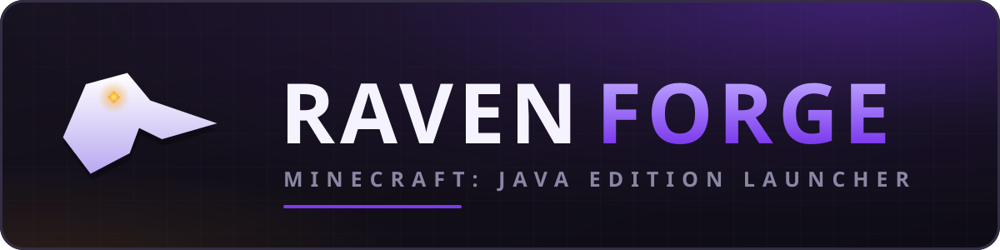

<p align="center">
  
</p>

> **⚠️ EARLY DEVELOPMENT — This project is in active early development. Expect breaking changes, missing features, incomplete UI, and rough edges. Not ready for production use. Contributions and feedback are welcome!**

Custom Minecraft: Java Edition launcher with mod management, auto-sync from server manifests, and server profiles.

Built with **Electron + TypeScript + React + Vite + Tailwind CSS**.

NOT AN OFFICIAL MINECRAFT PRODUCT. NOT APPROVED BY OR ASSOCIATED WITH MOJANG OR MICROSOFT.

---

## Features

- **Server Profiles** — per-server instance configs with pinned MC version, mod loader, and remote manifest
- **Pack Install** — start a profile from a White Ravens pack, a `.mrpack` file, a manifest URL, or an empty form
- **Mod Auto-Sync** — fetch server manifest → check its signature → diff → parallel download → verify each hash → install
- **Mod Browser** — search Modrinth from the launcher, filtered to your profile
- **Compatibility Checks** — warns before an install that does not fit the profile, and pulls in required dependencies
- **Bilingual UI** — Polish and English, switchable in Settings
- **Mod Loader Engine** — auto-install Fabric, Quilt, Forge and NeoForge, or run Vanilla
- **Microsoft Auth** — full OAuth 2.0 → Xbox Live → Minecraft JWT chain + offline mode
- **Java Management** — auto-download Adoptium Temurin JRE (Java 8/17/21)
- **Shaders & Resource Packs** — first-class content management per profile
- **Auto-Update** — launcher self-updates via GitHub Releases (electron-updater)
- **Modern UI** — dark gaming-grade design, animated voxel hero scenes (drone flight, Nether forge, mine, tech workshop), news feed, frameless window

---

## Dev Setup

### Prerequisites

| Tool | Version |
|------|---------|
| Node.js | ≥ 24.0.0 (LTS) |
| npm | ≥ 11.0.0 |
| Git | any recent |

### Windows 10/11

```bash
# Clone
git clone https://github.com/whiteravens20/raven-forge.git
cd raven-forge

# Install dependencies
npm install

# Run in development mode
npm run dev
```

> **Note:** On Windows, you may need to install Visual Studio Build Tools for native modules (keytar):
> `npm install --global windows-build-tools` or install the "Desktop development with C++" workload from Visual Studio Installer.

### Debian / Ubuntu

```bash
# System dependencies for Electron + keytar
sudo apt update
sudo apt install -y build-essential libsecret-1-dev libx11-dev libxss1 libnotify4

# Clone
git clone https://github.com/whiteravens20/raven-forge.git
cd raven-forge

# Install dependencies
npm install

# Run in development mode
npm run dev
```

---

## npm Scripts

| Script | Description |
|--------|-------------|
| `npm run dev` | Start Electron + Vite dev server (hot reload) |
| `npm run build` | Build main + renderer for production |
| `npm run dist` | Build + package installer (auto-detect platform) |
| `npm run dist:win` | Build + package NSIS installer (Windows) |
| `npm run dist:linux` | Build + package .deb + AppImage (Linux) |
| `npm run icons` | Rasterise `icon.svg` → `icon.png`, `icon.ico`, installer sidebar |
| `npm run lint` | Run ESLint |
| `npm run lint:fix` | Run ESLint with auto-fix |
| `npm run typecheck` | TypeScript type checking (all projects) |
| `npm test` | Run the Vitest suite once |
| `npm run test:watch` | Vitest in watch mode |
| `npm run format` | Format code with Prettier |
| `npm run format:check` | Check formatting without writing |
| `npm run clean` | Remove dist/ and out/ |

---

## Project Structure

```
src/
├── main/           # Electron main process (Node.js)
├── preload/        # contextBridge preload scripts
├── renderer/       # React SPA (Vite-bundled)
│   ├── components/ # UI components
│   ├── pages/      # Route pages
│   ├── stores/     # Zustand state stores
│   ├── i18n/       # UI string dictionaries (pl, en) + tiny t() helper
│   └── styles/     # Tailwind entry + backdrop animations
├── core/           # Business logic (runs in main process)
│   ├── auth/       # Microsoft OAuth + offline auth
│   ├── config/     # Settings + paths
│   ├── java/       # Adoptium JRE management
│   ├── minecraft/  # Version manifest, assets, game launcher
│   ├── modloader/  # Fabric/Quilt/Forge/NeoForge installers
│   ├── mods/       # Manifest fetch, sync, Modrinth API, integrity, compatibility
│   ├── net/        # Proxy dispatcher + the shared download helper
│   ├── news/       # News + announcement feeds
│   ├── packs/      # .mrpack reader, pack catalogue, profile-from-pack install
│   ├── profiles/   # Profile CRUD + import/export
│   └── updater/    # electron-updater + Ed25519 manifest verification
└── shared/         # Types shared between main + renderer
    ├── ipc-types.ts    # the channel contract
    └── ipc/            # payload shapes, one file per domain

test/               # Vitest suites (pure logic) + Electron/keytar stubs
```

---

## Configuration: News Feed, Backgrounds & Announcements

A fresh install points at White Ravens' published feeds (listed under [Live endpoints](#live-endpoints)). Both are yours to change — under Settings, or in the settings JSON file at `<userData>/settings.json`. Clearing a field switches that section off rather than restoring the default.

### News Feed
```json
{
  "newsFeedUrl": "https://your-server.com/api/news.json"
}
```
Expected response format:
```json
[
  {
    "id": "1",
    "title": "Server Update 1.21",
    "excerpt": "We've updated to 1.21 with new mods!",
    "body": "## What changed\n- Mekanism 10.7\n- New spawn\n\nSee **Profiles** to sync.",
    "url": "https://your-server.com/blog/update-121",
    "imageUrl": "https://your-server.com/images/news-1.jpg",
    "publishedAt": "2026-03-15T12:00:00Z"
  }
]
```

Only `id`, `title`, `excerpt` and `publishedAt` are required. Clicking a card opens `body` **inside the launcher**, so a feed needs no website behind it; `url` is an optional "open in browser" link rather than the way in.

`body` accepts a small Markdown subset — `## headings`, `- lists`, `**bold**`, `*italic*`, `` `code` `` and `[links](https://…)`. It is parsed into elements, never into HTML, so a feed cannot inject markup. Anything outside the subset renders as the literal text you wrote.

### Announcements
```json
{
  "announcementFeedUrl": "https://your-server.com/api/announcements.json"
}
```
Expected response format:
```json
[
  {
    "id": "1",
    "message": "Maintenance scheduled for Saturday 10 PM UTC",
    "type": "warning",
    "title": "Scheduled maintenance",
    "body": "The server goes down at 22:00 UTC for about two hours.\n\n- World backup\n- Mod updates",
    "url": "https://your-server.com/status",
    "dismissible": true
  }
]
```

`title` and `body` are optional and use the same Markdown subset as news. A banner is only clickable when it has one of `body` or `url` — a dialog that repeats the banner's own sentence teaches people the click is not worth making.

### Live endpoints

White Ravens publishes both feeds — and the pack manifests — from the sibling
[raven-packs](https://github.com/whiteravens20/raven-packs) repository, which
doubles as a working reference for each format:

| Setting | URL |
|---|---|
| News feed | `https://whiteravens20.github.io/raven-packs/raven-forge/news.json` |
| Announcement feed | `https://whiteravens20.github.io/raven-packs/raven-forge/announcements.json` |
| Profile manifest (Raven MC) | `https://whiteravens20.github.io/raven-packs/ravenmc/manifest.json` |

Manifests published there are Ed25519-signed. Adding the public key under
**Settings → Trusted Keys** does two things: the profile gets a verified badge,
and — more importantly — the launcher will from then on refuse to install a
manifest that is not signed by a key you trust. Until you add one, signatures
are reported but not enforced, which is what keeps unsigned packs from anywhere
else installable.

### Forking

Every address the launcher ships pointing at White Ravens lives in one file,
[`src/shared/branding.ts`](src/shared/branding.ts): the two feed defaults and
the pack catalogue behind *Play on the White Ravens servers*. Change those three
constants and a fork inherits none of our infrastructure. Nothing else in the
codebase hardcodes a `whiteravens20` URL.

The two feed values are only *defaults* — they seed a first launch and an
install that predates them, and any player can point them elsewhere. The
catalogue URL is deliberately not settable: its entries become manifest URLs
that profiles get created from, so a settable address would turn a screen badged
White Ravens into a way to serve somebody arbitrary manifests. The manifest-URL
and `.mrpack` import routes exist for everything else, and there the address is
plainly the player's own.

### UI Language

Polish and English ship in `src/renderer/i18n/`; switch under Settings → Appearance. Adding a language is copying `en.ts`, translating the values, and registering it — TypeScript names any key you miss. See [CONTRIBUTING.md](CONTRIBUTING.md#translations).

### Background Images
Place `.jpg` / `.png` files in a local folder and set:
```json
{
  "customBackgroundsPath": "/path/to/your/backgrounds"
}
```
Or leave empty to use the built-in default backgrounds.

> **Note:** An empty `newsFeedUrl` or `announcementFeedUrl` shows an empty section — the launcher has no placeholder copy to fall back on, because demo text presented as a server's announcements is worse than nothing.

---

## Mod Sources

| Source | API key | Notes |
|---|---|---|
| **Modrinth** | not needed | The primary source. Search, version lookup and downloads all go through the [public API](https://docs.modrinth.com/). Publishes `sha512`. |
| **Direct URL** | — | For custom or private mods, via the manifest's `"source": "url"` field. Skips API lookups entirely and keeps working when a source is down. |
| **Local file** | — | A jar you already have, via `"source": "local"`. |

**CurseForge is deliberately not supported.** Its API key is issued per developer
after a manual application, and the [3rd Party API terms](https://support.curseforge.com/support/solutions/articles/9000207405-curse-forge-3rd-party-api-terms-and-conditions)
make it non-transferable and unshareable — so a key can neither be shipped in a
public binary nor be expected from a player. Since **16 July 2026** CurseForge's
CDN also rejects unauthenticated downloads (`401 A valid api-key is required`),
which closes the last route that did not need one. A CurseForge-only mod has to
be downloaded by hand and added as a local file.

---

## Pack Formats

A new profile can start from a whole pack rather than an empty form.

| Route | Format | Keeps updating? |
|---|---|---|
| **White Ravens packs** | The catalogue at [`raven-packs`](https://github.com/whiteravens20/raven-packs), which publishes a `packs.json` index beside each pack's manifest | Yes — the profile stores the manifest URL and every sync reconciles against it |
| **A link** | Either a Raven Forge manifest v2 or a `.mrpack` — including the link behind Modrinth's Download button | A manifest, yes; a `.mrpack`, no |
| **`.mrpack` file** | [Modrinth's modpack format](https://support.modrinth.com/en/articles/8802351-modrinth-modpack-format-mrpack) — a zip holding `modrinth.index.json` and `overrides/` | No — an import is a snapshot of one version |

One field takes both kinds of link, and which one arrived is decided from the
bytes at the address rather than from the file extension: Modrinth's CDN ends
its URLs in `.mrpack`, but a signed or proxied link need not, and it is the
content that decides what a thing is. A manifest is stored on the profile and
re-read on every sync; a `.mrpack` is unpacked once, exactly like the file route.

`.mrpack` is the only open, cross-launcher pack format the launcher reads; Prism,
ATLauncher, MultiMC and the Modrinth app produce and consume the same files. An
import is converted into a manifest and installed through the ordinary sync path,
so it gets the same hash verification, orphan handling and resource-pack ordering
as a server pack. CurseForge's pack zip is not read, for the reason above: its
files cannot be fetched without a key.

Paths inside a pack are checked before anything is written. An entry that tries
to leave the game directory is refused outright rather than trimmed and installed
somewhere else.

---

## Build & Release

### Supported targets

| Target | File | Size | Runs on |
|---|---|---|---|
| NSIS installer | `Raven Forge Launcher Setup <version>.exe` | ~96 MB | **Windows 11** and Windows 10 (1809+), x64 |
| Debian package | `raven-forge-launcher_<version>_amd64.deb` | ~90 MB | **Debian 11+**, **Ubuntu 20.04+**, x64 |
| AppImage | `Raven Forge Launcher-<version>.AppImage` | ~115 MB | Any x64 Linux with glibc ≥ 2.25 |

The Linux floor is the Electron binary's own: it links `GLIBC_2.25`, and the
package depends on `libnotify4`, `libxss1` and `libsecret-1-0` — all stock in
both Debian and Ubuntu. Windows 7/8/8.1 are not supported; Electron dropped them.

### Manual build

Every target needs the app built first, which `npm run dist*` does for you.
App icons are generated, not committed — run `npm run icons` after changing
`assets/icons/icon.svg` (it writes `icon.png`, `icon.ico` and the NSIS sidebar
bitmap; it needs a display, so on a headless box give it an X server).

```bash
# Linux — .deb + AppImage
npm run dist:linux

# Windows — NSIS installer
npm run dist:win
```

Output goes to `out/`, alongside `latest.yml` and a `.blockmap` for
electron-updater.

Set `RAVENFORGE_CLIENT_ID` on the build command to bake in Microsoft login —
see [docs/AZURE-SETUP.md](docs/AZURE-SETUP.md). Without it the installer is
built fine and the launcher works in offline mode.

#### Building the Windows installer from Linux

electron-builder shells out to `signtool.exe` and `makensis.exe`, so it needs
wine. Tested against **WineHQ stable 11.0** on Debian 12:

```bash
sudo dpkg --add-architecture i386
sudo mkdir -pm755 /etc/apt/keyrings
sudo wget -O /etc/apt/keyrings/winehq-archive.key https://dl.winehq.org/wine-builds/winehq.key
sudo wget -NP /etc/apt/sources.list.d/ \
  https://dl.winehq.org/wine-builds/debian/dists/bookworm/winehq-bookworm.sources
sudo apt update && sudo apt install --install-recommends winehq-stable

# Initialise the prefix ONCE with the Mono/Gecko prompts disabled.
# Skip this and `wineboot --init` blocks on a dialog, and the build hangs
# forever with no output at all.
WINEDLLOVERRIDES="mscoree,mshtml=" wineboot -u
```

On Ubuntu use the matching `winehq-<codename>.sources` file from the same
directory. The GitHub Actions release workflow sidesteps all of this by
building the Windows target on a `windows-latest` runner.

### Installing what you built

**Windows 11 / 10** — run the `Setup .exe`. It is a per-user install by
default, so no administrator prompt, and it lets you pick the directory.
Unsigned builds trip SmartScreen; see [docs/SIGNING.md](docs/SIGNING.md).

**Debian / Ubuntu (.deb)** — recommended:

```bash
sudo apt install ./raven-forge-launcher_0.1.0_amd64.deb
```

`apt` pulls the three library dependencies. The package's post-install step
sets the SUID bit on `chrome-sandbox`, which the renderer needs because it runs
with `sandbox: true`.

**AppImage** — `chmod +x` and run it. One caveat worth knowing: **Ubuntu 23.10
and later** restrict unprivileged user namespaces through AppArmor, and an
AppImage cannot carry a SUID `chrome-sandbox` because it is mounted as your own
user. Electron apps therefore fail to start there. Prefer the `.deb` on Ubuntu;
if you need the AppImage, install an AppArmor profile for it, or relax the
restriction system-wide:

```bash
sudo sysctl -w kernel.apparmor_restrict_unprivileged_userns=0
```

Debian does not apply that restriction, so the AppImage runs as-is.

### CI/CD (GitHub Actions)

- **Push or PR to `main`/`dev`** → lint, typecheck, tests, format check, and build on Linux + Windows ([build.yml](.github/workflows/build.yml))
- **Push or PR to `main`/`dev`, plus weekly** → CodeQL ([codeql.yml](.github/workflows/codeql.yml)) and the dependency/secret gates ([security.yml](.github/workflows/security.yml))
- **Nightly and on demand** → the full electron-builder run for both platforms ([package.yml](.github/workflows/package.yml)), so a packaging regression surfaces on a weekday rather than during a release
- **Push a tag `v*`** (e.g. `git tag v0.1.0 && git push --tags`) → builds installers, signs (if certs configured), and creates a draft GitHub Release ([release.yml](.github/workflows/release.yml))

### Code Signing

Two separate systems — Authenticode for the Windows installer, Ed25519 for mod manifests. Both are documented in **[docs/SIGNING.md](docs/SIGNING.md)**.

Short version for the installer: add `WIN_CSC_LINK` (base64 of your `.pfx`) and `WIN_CSC_KEY_PASSWORD` as repository secrets and the release workflow signs the `.exe`. Without them the build still succeeds and produces an **unsigned** installer — check the artefacts rather than assuming.

---

## Architecture

See [docs/ARCHITECTURE.md](docs/ARCHITECTURE.md) for detailed architecture documentation including:
- Mod-sync data flow diagram
- Microsoft OAuth authentication chain
- Launcher startup sequence
- IPC channel map

---

## Contributing

Contributions are welcome — bug fixes, macOS support, accessibility and translations.

| Document | What it covers |
|---|---|
| [CONTRIBUTING.md](CONTRIBUTING.md) | Setup, project layout, coding guidelines, how to verify a change, PR process |
| [CODE_OF_CONDUCT.md](CODE_OF_CONDUCT.md) | Community expectations |
| [SECURITY.md](SECURITY.md) | Security model, known gaps, and how to report a vulnerability privately |

`dev` is the working branch; `main` is a release snapshot synced from it by the maintainer. Fork and open your PR against `dev`, never `main`. Commits follow [Conventional Commits](https://www.conventionalcommits.org/), one topic per commit, subject line only. There is **no `CHANGELOG.md`** — release notes are generated by GitHub from everything that landed since the previous tag, grouped by [`.github/release.yml`](.github/release.yml).

> **Found a security bug?** Do not open a public issue — use [private vulnerability reporting](https://github.com/whiteravens20/raven-forge/security/advisories/new). And redact access tokens from any log you attach.

---

## License

PolyForm Noncommercial 1.0.0 — see [LICENSE](LICENSE) for details.

You are free to use, modify, and share this software for **non-commercial purposes only**. Commercial use (selling, monetizing, offering as a paid service, etc.) is not permitted without explicit written permission from the author.

NOT AN OFFICIAL MINECRAFT PRODUCT. NOT APPROVED BY OR ASSOCIATED WITH MOJANG OR MICROSOFT.

---

## Built with AI — How We Fight AI Slop

This project was built with the help of **AI coding assistants**. We believe in transparency about AI involvement and in keeping quality high despite using AI tools.

### What "AI slop" is and how we fight it

"AI slop" is low-quality, bloated, copy-paste code that AI generates when used carelessly — dead code, unnecessary abstractions, hallucinated APIs, cargo-culted patterns, and verbose boilerplate nobody asked for. It's the software equivalent of SEO spam articles.

Here's how this project stays above that bar:

1. **Human-driven architecture** — Every design decision (tech stack, folder structure, IPC protocol, auth chain) was made by a human. AI executed the plan, not the other way around.
2. **Strict compilation gates** — Every generated file must pass `tsc --noEmit` (zero type errors) and `eslint` (zero lint errors) before being accepted. No "it looks right" — it compiles or it doesn't ship.
3. **No dead code policy** — Unused imports, unreachable branches, and placeholder stubs are caught by linting rules (`no-unused-vars`, `no-explicit-any`) and removed immediately.
4. **Minimal abstraction** — No premature DRY, no "just in case" wrappers, no 5-layer indirection for a simple function call. Code is as simple as the task requires.
5. **Real implementations over stubs** — Where a feature is implemented, it's a real working implementation (OAuth chain, Adoptium JRE download, Modrinth search, Mojang asset pipeline). Where it's not ready, it's explicitly marked as a stub with a clear error message — never a silent no-op.
6. **Iterative review** — AI output is reviewed, tested, and corrected in the same session. Bugs introduced by AI are fixed immediately, not left for "later."

If you spot AI slop in this codebase — dead code, nonsensical comments, hallucinated APIs, over-engineered abstractions — please open an issue. Keeping code clean is a shared responsibility.