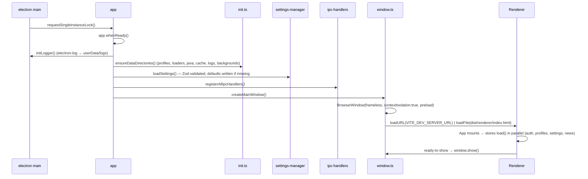

# Raven Forge Launcher — Architecture

## Tech stack

| Layer | Choice | Rationale |
|---|---|---|
| Shell | **Electron 41** | Mature ecosystem, first-class Windows + Linux packaging via electron-builder, signed auto-updates via electron-updater, and predictable Node integration for game-launching subprocesses. Tauri was considered but its Rust toolchain raises the contributor bar and its WebView2/WebKitGTK story complicates spawning Java with full stdio capture across platforms. |
| Renderer | **React 19 + Vite 7** | Strict typing, fast HMR, broad ecosystem (Zustand, Framer Motion, react-router). |
| Styling | **Tailwind v4 + CSS custom properties** | Theming via `--rf-*` variables on `[data-theme]`, atomic utility classes for the dark gaming aesthetic. The Vite plugin (`@tailwindcss/vite`) is the supported v4 integration; PostCSS is intentionally not configured. |
| State | **Zustand** | Tiny, no providers, easy to share between pages. |
| Validation | **Zod** | Runtime validation at IPC + manifest boundaries; types inferred via `z.infer`. |
| Crypto | **tweetnacl** | Pure-JS Ed25519 for manifest signature verification — avoids native dependency churn. |
| Secret storage | **keytar** | OS keychain (Credential Manager / libsecret / Keychain) for MSA refresh tokens and Minecraft session tokens. Degrades to a `0600` file where no keyring exists. |
| Logging | **electron-log** | File rotation, level filtering, accessible from `Settings → Open logs folder`. |

## Project layout

```
raven-forge/
├── PLAN.md                       # original brief, preserved as work plan
├── README.md                     # dev setup + feature overview
├── docs/
│   ├── ARCHITECTURE.md           # this document
│   ├── AZURE-SETUP.md            # registering the Azure app + Mojang approval
│   ├── MANIFEST-SCHEMA.md        # remote manifest spec
│   ├── PRIVACY.md                # what is stored and sent (EN — canonical pair)
│   ├── PRIVACY.pl.md             # the same, in Polish; both are maintained
│   └── SIGNING.md                # Ed25519 manifest signing
├── electron-builder.config.js    # NSIS + .deb + AppImage targets
├── eslint.config.mjs             # flat-config, react + @typescript-eslint
├── tsconfig.json                 # umbrella project for typecheck-all
├── tsconfig.main.json            # main + preload + core + shared (Node ESM)
├── tsconfig.renderer.json        # renderer (DOM)
├── tailwind.config.ts            # design tokens + custom animations
├── vite.config.ts                # renderer build + path aliases
├── .github/workflows/
│   ├── build.yml                 # PR / push CI
│   └── release.yml               # tag-triggered, signs + drafts release
└── src/
    ├── main/                     # Electron main process
    │   ├── index.ts              # entry — single-instance, lifecycle, IPC bootstrap
    │   ├── window.ts             # BrowserWindow factory (frameless, secure defaults)
    │   ├── ipc-handlers.ts       # all ipcMain.handle registrations
    │   ├── init.ts               # data-directory bootstrap
    │   └── logger.ts             # electron-log setup
    ├── preload/
    │   └── index.ts              # contextBridge — exposes typed RavenForgeAPI
    ├── renderer/                 # React SPA
    │   ├── main.tsx, App.tsx
    │   ├── pages/                # one per route
    │   ├── components/           # ui/ (Button, Input, Banner, Select) + layout/
    │   ├── stores/               # Zustand stores (auth, profiles, news, settings, launch)
    │   └── styles/global.css     # @import "tailwindcss" + CSS variables
    ├── core/                     # business logic, runs in main process
    │   ├── auth/                 # MS OAuth → Xbox → XSTS → MC chain, keytar token store
    │   ├── diagnostics/          # crash-report.ts — one redacted file per crash
    │   ├── java/                 # Adoptium Temurin download + version selection
    │   ├── minecraft/            # version manifest, asset/library download, game launcher
    │   ├── modloader/            # Fabric, Quilt, Forge and NeoForge installers
    │   ├── mods/                 # manifest sync, Modrinth API, content (shaders/RP) manager
    │   ├── updater/              # electron-updater wiring, manifest signature verification
    │   ├── profiles/             # profile CRUD + import/export
    │   ├── news/                 # news + announcement fetcher with mock fallback
    │   └── config/               # paths.ts, settings-manager.ts, defaults.ts
    └── shared/                   # types + validators consumed by both processes
        ├── ipc-types.ts          # InvokeChannels, EventChannels, RavenForgeAPI
        ├── ipc/                  # payload shapes, one file per domain
        ├── validators.ts         # Zod schemas for settings + profiles
        ├── manifest-schema.ts    # Zod schema for remote manifests
        └── constants.ts          # endpoints, defaults, MC→Java mapping
```

## IPC contract

All renderer → main calls go through typed channels declared in [`src/shared/ipc-types.ts`](../src/shared/ipc-types.ts) and exposed as `window.ravenforge.<domain>.<method>` via the preload contextBridge. Returns `IpcResult<T> = { success, data?, error? }` so renderer code never throws on cross-process errors.

Channels are grouped by domain: `auth`, `profiles`, `mods`, `content` (shaders + resource packs), `java`, `loaders`, `game`, `settings`, `news`, `announcements`, `manifest` (verification), `updater`, `system`, `window`.

Push events from main → renderer (`webContents.send`) cover progress (`progress:mod-sync`, `progress:java-download`, …), game lifecycle (`game:log`, `game:started`, `game:exited`), auth state changes, and updater state.

## Mod-sync data flow

```mermaid
sequenceDiagram
    actor User
    participant UI as Renderer
    participant Main as Main process
    participant FS as Profile dir
    participant Manifest as Remote manifest
    participant Modrinth as Modrinth / URL host

    User->>UI: Click "Sync" or launch profile
    UI->>Main: mods:sync-manifest(profileId)
    Main->>Manifest: GET manifest.json (If-None-Match)
    Manifest-->>Main: 200 manifest JSON | 304 not modified
    Main->>Main: Zod-validate modManifestSchema
    Main->>Main: Verify Ed25519 signature; refuse if trusted keys are set and it does not
    Main->>FS: Read installed.lock
    Main->>Main: Diff manifest vs lock
    par Parallel downloads (concurrency limit)
        Main->>Modrinth: GET mod jar
        Modrinth-->>Main: bytes
        Main->>Main: Verify the hash the manifest published
        Main->>FS: write .minecraft/mods/<file>.jar
    end
    Main->>FS: Write installed.lock
    Main-->>UI: progress:mod-sync events throughout
    Main-->>UI: IpcResult<void>
```

## Microsoft auth chain

```mermaid
sequenceDiagram
    actor User
    participant UI as Renderer
    participant Main as Main process
    participant MS as login.microsoftonline.com
    participant XBL as user.auth.xboxlive.com
    participant XSTS as xsts.auth.xboxlive.com
    participant MC as api.minecraftservices.com
    participant KC as OS keychain (keytar)

    User->>UI: Click "Login with Microsoft"
    UI->>Main: auth:login-microsoft
    Main->>MS: Open OAuth window — authorize endpoint
    User->>MS: Sign in + consent
    MS-->>Main: redirect with ?code
    Main->>MS: POST /token (code → access + refresh)
    MS-->>Main: ms_access_token, ms_refresh_token
    Main->>XBL: POST /authenticate (RpsTicket=d=ms_access_token)
    XBL-->>Main: xbl_token, userHash
    Main->>XSTS: POST /authorize (xbl_token → minecraft RP)
    XSTS-->>Main: xsts_token  (XErr 2148916233/238 surfaced as friendly errors)
    Main->>MC: POST /authentication/login_with_xbox (XBL3.0 x=hash;xsts)
    MC-->>Main: mc_access_token
    Main->>MC: GET /minecraft/profile (Bearer mc_access_token)
    MC-->>Main: { id, name, skins }  (404 ⇒ "Account does not own Java Edition")
    Main->>KC: setPassword("msRefresh:<id>", ms_refresh_token)
    Main->>KC: setPassword("mcAccess:<id>", mc_access_token)
    Main-->>UI: IpcResult<MinecraftAccount>
```

### Where credentials live

`auth.json` holds the account list, the active account id, and each session's
**expiry** — no secrets. The tokens themselves go to the OS keychain under
service `com.ravenforge.launcher`:

| Key | Lifetime | Used for |
|---|---|---|
| `msRefresh:<accountId>` | months, until revoked | Re-running the Xbox→XSTS→MC chain silently |
| `mcAccess:<accountId>` | ~24 h | The `--accessToken` JVM argument at launch |

Keeping `expiresAt` in the file is deliberate: the "does this need refreshing?"
check on every launch costs a file read, and only actually *spending* the token
touches the keychain.

**Fallback.** A machine with no keyring daemon — headless Linux, a bare window
manager, a locked keyring — makes keytar throw at call time, not load time.
Rather than making Microsoft login impossible there, `secret-store.ts` reports
the failure and `token-store.ts` writes the secret to `auth.json` instead, with
the file forced to mode `0600` and a warning in the log. This is a deliberate
downgrade, not an accident; on a healthy install `refreshTokens` stays `{}`.

Upgrading from a pre-keychain build migrates automatically on first read:
plaintext secrets move into the keychain and are stripped from the file. Any
entry the keychain rejects is left untouched, so a failed migration never costs
the user a login.

**Logging out clears the sign-in cookies.** The authorization window runs in the
default session — it has to, or the configured proxy would not apply to it — so
Microsoft's cookies outlive the account unless something removes them, and a
"log out" the next sign-in can see straight through is not one. `logoutAccount`
clears the whole cookie jar when the account being removed is a Microsoft one.
The whole jar rather than a Microsoft domain list: the launcher's own page is a
`file://` document that sets no cookies, so everything in there was set by a
page the sign-in flow loaded, and a domain list would be one more thing to keep
correct as Microsoft moves hosts around. An offline account never opened that
window, so its logout leaves the jar alone.

## Launcher startup sequence



## Security posture

- `contextIsolation: true`, `nodeIntegration: false`, `sandbox: true` — on the main window and on the Microsoft sign-in window, which is the only one that loads someone else's page.
- Credentials are stored in the OS keychain, not in `auth.json` — see [the auth flow](#where-credentials-live) for the fallback and its trade-off.
- The preload script is the only bridge — every renderer-callable function goes through `ipcRenderer.invoke` against a known channel name.
- `system:open-url` rejects anything that isn't `http://` / `https://`.
- `setWindowOpenHandler` denies `window.open`, and a `will-navigate` handler denies top-level navigation; both route external links to the OS browser.
- `system:open-path` is confined to the launcher's own data and log directories. It runs whatever the OS associates with the target, so an unrestricted one is a way to execute an arbitrary file.
- The Content-Security-Policy is served as a response header (`src/main/security.ts`) as well as in a `<meta>` tag. Only the header cannot be outrun by markup injected ahead of the tag.
- Every `ipcMain.handle` goes through a sender check, so a handler added later cannot be the first one to forget it.
- The Microsoft OAuth flow uses PKCE (S256) and a `state` value, and accepts a code only from the exact redirect URI it asked for.
- Every download is verified against the strongest hash its source published — sha512, sha256 or sha1, in that order (`expectedHash` in `core/mods/integrity.ts`). Modrinth supplies sha512 for every file; a `.mrpack` supplies sha512 and sha1; a manifest entry may publish any of them. **An entry that publishes no hash at all is installed unverified** — the launcher does not invent one. Mojang's own assets and libraries are the exception that does retry: `asset-downloader.ts` retries a failed or mismatched download three times, because it is fetching thousands of files. `downloadToFile`, which fetches mods, does not retry.
- The Forge/NeoForge installer jar, the Adoptium JRE and the vanilla client jar are all executed or extracted after download, and all three are checked against a published checksum where the publisher provides one (Maven `.sha512`/`.sha256`/`.sha1` sidecars, Adoptium's `/assets` response, Mojang's version metadata). Where none exists the download proceeds over HTTPS and says so in the log.
- Manifest Ed25519 signatures are checked inside the sync, on the exact document about to be installed, before anything is downloaded. The White Ravens publisher key is **compiled into the launcher** (`src/shared/branding.ts`) and always in the key ring, so a first-party pack verifies on a fresh install; shipping it beats downloading it, since a key served next to the manifest it signs is written by whoever wrote the manifest. **With no trusted keys configured nothing is enforced** — that is the default install, and refusing every unsigned manifest out of the box would refuse every pack that exists. **Adding a trusted key switches enforcement on**: from then on a manifest for that profile must carry a signature that verifies, and an unsigned one is refused rather than waved through, because otherwise stripping the signature would be a way past the check. The badge on the profile reports what the last sync found, not what a fresh fetch would find.

## Build pipeline

| Step | Tool | Output |
|---|---|---|
| Renderer | `vite build` | `dist/renderer/` (HTML + hashed JS/CSS) |
| Main + preload + core + shared | `tsc -p tsconfig.main.json` | `dist/main/`, `dist/preload/`, `dist/core/`, `dist/shared/` |
| Package | `electron-builder` | `out/` — NSIS `.exe` (Windows), `.deb` + `.AppImage` (Linux) |

The `package.json` `main` field points at `dist/main/index.js`; the preload reference inside `window.ts` is `path.join(__dirname, '..', 'preload', 'index.js')`, which resolves correctly from `dist/main/`.

## Open implementation gaps

Last checked against the code on **2026-08-07**. Keep it that way — a stale gap
list is worse than none, because it sends people looking for problems that were
fixed and hides the ones that were not.

- **Microsoft login is untested against a real Azure app.** The OAuth → Xbox Live
  → Minecraft JWT chain is written and the client id is injected at build time,
  but no approved application exists yet, so the whole path — including the
  `AUTH_UNREACHABLE` offline offer — has only ever been exercised against stubs.
- **The launcher has never updated itself from a published release.** The update
  check, platform matrix and install-before-play path are covered by tests, but
  there is no tagged release to update *from*.
- **Crash reports have never been produced by a real crash.** `crash-report.ts`
  is unit-tested and was exercised end to end in the running app against a
  synthetic `game:exited` and a hand-written Mojang crash file, so
  `readMinecraftCrash` reading a genuine one is still unproven.
- **The startup update check cannot be switched off.** One request to GitHub
  Releases on every launch, with no setting behind it — itemised in
  [PRIVACY.md](PRIVACY.md) rather than left for someone to discover.
- **Launcher logs are not redacted.** Only crash reports are. `main.log` echoes
  the game's stdout verbatim, and a mod that prints its launch arguments prints
  a live session token with them.
- No Mica/acrylic backdrop on Windows 11; no one-click rollback to the previous
  launcher version; no warning when a user-installed mod collides with a manifest
  mod.
- Dead IPC surface: `java:*`, `game:kill`, `game:is-running` and
  `announcements:dismiss` are declared, handled and exposed but never called from
  the renderer. `game:kill` is the one that costs the user something — there is
  no way to stop a running game from the launcher.
