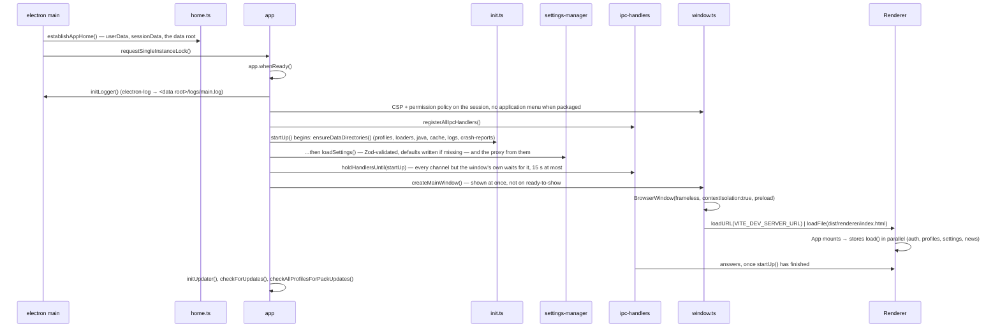

# Raven Forge Launcher — Architecture

## Tech stack

| Layer          | Choice                                  | Rationale                                                                                                                                                                                                                                                                                                                                                             |
| -------------- | --------------------------------------- | --------------------------------------------------------------------------------------------------------------------------------------------------------------------------------------------------------------------------------------------------------------------------------------------------------------------------------------------------------------------- |
| Shell          | **Electron 44**                         | Mature ecosystem, first-class Windows + Linux packaging via electron-builder, signed auto-updates via electron-updater, and predictable Node integration for game-launching subprocesses. Tauri was considered but its Rust toolchain raises the contributor bar and its WebView2/WebKitGTK story complicates spawning Java with full stdio capture across platforms. |
| Renderer       | **React 19 + Vite 8**                   | Strict typing, fast HMR, broad ecosystem (Zustand, react-router).                                                                                                                                                                                                                                                                                                     |
| Styling        | **Tailwind v4 + CSS custom properties** | Theming via `--rf-*` variables on `[data-theme]`, atomic utility classes for the dark gaming aesthetic. The Vite plugin (`@tailwindcss/vite`) is the supported v4 integration; PostCSS is intentionally not configured.                                                                                                                                               |
| State          | **Zustand**                             | Tiny, no providers, easy to share between pages.                                                                                                                                                                                                                                                                                                                      |
| Validation     | **Zod**                                 | Runtime validation at IPC + manifest boundaries; types inferred via `z.infer`.                                                                                                                                                                                                                                                                                        |
| Crypto         | **tweetnacl**                           | Pure-JS Ed25519 for manifest signature verification — avoids native dependency churn.                                                                                                                                                                                                                                                                                 |
| Secret storage | **keytar**                              | OS keychain (Credential Manager / libsecret / Keychain) for MSA refresh tokens and Minecraft session tokens. Degrades to a `0600` file where no keyring exists.                                                                                                                                                                                                       |
| Logging        | **electron-log**                        | File rotation, level filtering, accessible from `Settings → Open logs folder`.                                                                                                                                                                                                                                                                                        |

## Project layout

```
raven-forge/
├── README.md                     # dev setup + feature overview
├── docs/
│   ├── ARCHITECTURE.md           # this document
│   ├── AZURE-SETUP.md            # registering the Azure app + Mojang approval
│   ├── DISCORD-SETUP.md          # registering the app behind the optional status
│   ├── MANIFEST-SCHEMA.md        # remote manifest spec
│   ├── PRIVACY.md                # what is stored and sent (EN — canonical pair)
│   ├── PRIVACY.pl.md             # the same, in Polish; both are maintained
│   ├── SIGNING.md                # Ed25519 manifest signing
│   └── UNINSTALL.md              # what each platform's uninstaller removes
├── build/installer.nsh           # the NSIS uninstaller's keep-or-delete question
├── electron-builder.config.js    # NSIS + .deb + AppImage targets
├── eslint.config.mjs             # flat-config, react-hooks + @typescript-eslint
├── tsconfig.json                 # base of tsconfig.test.json, and an editor's map from a file to its project
├── tsconfig.main.json            # main + preload + core + shared (Node ESM)
├── tsconfig.renderer.json        # renderer (DOM)
├── vite.config.mts               # renderer build + path aliases
├── .github/workflows/
│   ├── build.yml                 # PR / push CI — lint, typecheck, test, build
│   ├── codeql.yml                # CodeQL analysis
│   ├── package.yml               # nightly: install the built packages on a clean box
│   ├── release.yml               # tag-triggered, builds + drafts the release
│   └── security.yml              # npm audit + Trivy secret & config scan
└── src/
    ├── main/                     # Electron main process
    │   ├── index.ts              # entry — single-instance, lifecycle, IPC bootstrap
    │   ├── window.ts             # BrowserWindow factory (frameless, secure defaults)
    │   ├── ipc-handlers.ts       # all ipcMain.handle registrations
    │   ├── init.ts               # data-directory bootstrap
    │   ├── security.ts           # navigation, window-open and permission policy
    │   └── logger.ts             # electron-log setup
    ├── preload/
    │   └── index.ts              # contextBridge — exposes typed RavenForgeAPI
    ├── renderer/                 # React SPA
    │   ├── main.tsx, App.tsx
    │   ├── pages/                # one per route
    │   ├── components/           # ui/ (Button, Input, Select, Switch, Banner, …) + layout/
    │   ├── stores/               # Zustand stores (auth, game, news, notice, profile, progress, settings, updater)
    │   ├── hooks/                # cross-page React hooks (e.g. the machine's memory)
    │   ├── i18n/                 # UI string dictionaries (pl, en) + the t() helper
    │   └── styles/global.css     # @import "tailwindcss", @theme tokens, per-theme --rf-*
    ├── core/                     # business logic, runs in main process
    │   ├── auth/                 # MS OAuth → Xbox → XSTS → MC chain, keytar token store
    │   ├── diagnostics/          # crash-report.ts — one redacted file per crash
    │   ├── discord/              # Rich Presence over Discord's local IPC socket (opt-in)
    │   ├── java/                 # Adoptium Temurin download + version selection
    │   ├── minecraft/            # version manifest, asset/library download, game launcher
    │   ├── modloader/            # Fabric, Quilt, Forge and NeoForge installers
    │   ├── mods/                 # manifest sync, Modrinth API, update checks, content manager
    │   ├── packs/                # .mrpack reader and writer, pack catalogue, profile-from-pack
    │   ├── net/                  # proxy dispatcher + the shared download helper
    │   ├── updater/              # electron-updater wiring, manifest signature verification
    │   ├── profiles/             # profile CRUD, import/export, world backups
    │   ├── news/                 # news + announcement fetcher; a feed that cannot be read is said so, never filled in
    │   ├── util/                 # atomic writes, cancellation, path containment, zip reading, refusals the page can say, machine memory
    │   └── config/               # paths.ts, app-home.ts, data-root.ts, data-root-move.ts, storage-map.ts, settings-manager.ts, defaults.ts
    └── shared/                   # types + validators consumed by both processes
        ├── ipc-types.ts          # InvokeChannels, EventChannels, RavenForgeAPI
        ├── ipc/                  # payload shapes, one file per domain
        ├── validators.ts         # Zod schemas for settings + profiles
        ├── memory.ts             # what of the machine's RAM a profile may take
        ├── manifest-schema.ts    # Zod schema for remote manifests
        ├── branding.ts           # the launcher's own names and addresses
        └── constants.ts          # endpoints, defaults, MC→Java mapping
```

## IPC contract

All renderer → main calls go through typed channels declared in [`src/shared/ipc-types.ts`](../src/shared/ipc-types.ts) and exposed as `window.ravenforge.<domain>.<method>` via the preload contextBridge. Returns `IpcResult<T> = { success, data?, error?, code?, errorMessage? }` so renderer code never throws on cross-process errors. `error` is always English — it is what the log keeps and what a bug report quotes. `code` tags a failure the UI has to _react_ to rather than merely show (`AUTH_UNREACHABLE` is the one), and `errorMessage` carries a translation key plus its variables for the failures the launcher raises about something the player can go and change, since `src/core/` has no locale. Progress lines travel the same way — see `ProgressKey`.

Channels are grouped by domain: `auth`, `profiles`, `packs` (the catalogue and the three ways a pack becomes a profile), `mods`, `content` (shaders + resource packs), `java`, `loaders`, `game`, `settings`, `news`, `announcements`, `manifest` (verification), `updater`, `system`, `window`.

Push events from main → renderer (`webContents.send`) cover progress (`progress:mod-sync`, `progress:java-download`, …), game lifecycle (`game:log`, `game:started`, `game:exited`), auth state changes, profile sync status, and updater state.

Both directions are kept free of channels nobody uses. A declared channel with no
caller is not harmless: it is API surface that reads as supported, and one of
them — `progress:mod-download` — had a subscriber in the renderer and a label in
the progress overlay while nothing in `src/core/` ever emitted it, so the UI held
a state it could never show.

## Mod-sync data flow

```mermaid
sequenceDiagram
    actor User
    participant UI as Renderer
    participant Main as Main process
    participant FS as Profile dir
    participant Manifest as Remote manifest
    participant Modrinth as Modrinth / URL host

    User->>UI: Click "Sync" or launch profile
    UI->>Main: mods:sync-manifest(profileId)
    Main->>Manifest: GET manifest.json (If-None-Match)
    Manifest-->>Main: 200 manifest JSON | 304 not modified
    Main->>Main: Zod-validate modManifestSchema
    Main->>Main: Verify Ed25519 signature; refuse if trusted keys are set and it does not
    Main->>FS: Read installed.lock
    Main->>Main: Diff manifest vs lock
    par Parallel downloads (concurrency limit)
        Main->>Modrinth: GET mod jar
        Modrinth-->>Main: bytes
        Main->>Main: Verify the hash the manifest published
        Main->>FS: write .minecraft/mods/<file>.jar
    end
    Main->>FS: Write installed.lock
    Main-->>UI: progress:mod-sync events throughout
    Main-->>UI: IpcResult<void>
```

**A sync happens on two triggers, and the badge on a third.** Pressing Sync is
one; launching a profile that follows a manifest is the other, because nothing
else in the launch path touches mods — it ensures the loader, Java, the client
jar and the assets, and used to start the game on whatever mod list happened to
be on disk. A player who never pressed Sync could join a server running a mod
list that server had stopped running.

The badge is separate, and passive. `checkForPackUpdates` runs once at startup
per profile: one conditional GET, diffed against `installed.lock`, written to the
sync state and pushed to the UI. It installs nothing and it never stores the ETag
it fetched — the recorded one means "the manifest this profile was reconciled
against", and keeping it is what lets the next real sync still see the update.
It does not keep the manifest it fetched either. The copy a profile holds and
the recorded ETag are written together, by a sync that finished: a server that
answers 304 to that ETag is answered with that copy, and with no network the
copy is what a sync runs against — so it has to be the manifest that was
installed, not one that was only looked at or that a failed sync got half-way
through.
It also refuses to report failure: a check nobody asked for turning a working
profile red would be worse than saying nothing, and pressing Sync reports
properly. Before this, `status` was only ever written when a sync ended, so a
profile read "Synced" from its last reconcile until the next one — however many
pack releases went by in between.

A pack's config overrides (`configFiles[]`) are applied on a different rule from
its mods, and the difference is the point. A mod jar is the pack's file and the
manifest's hash is the last word on it. A config file becomes the _player's_ the
moment they open the game — so the sync records which version of each override it
last delivered (`appliedConfigs` in the profile's sync state) and writes the file
only when that version changed, or when the file is gone.

Hashing the file on disk cannot answer this, and using it as the test was a real
bug: Minecraft rewrites `options.txt` on every exit, so from the first session
onwards the file never matched the manifest again, and every sync handed the
player's FOV, volume and keybinds back to the pack's defaults. Comparing what the
pack says now against what the pack said last time separates the author's update
from the player's edit, and only the author's update is delivered.

### A file the player already has

Not everything is on Modrinth, so a mod, a shader pack and a resource pack can
each be added from a file (`core/mods/local-mod.ts`, `addContentFromFile` in
`core/mods/content-manager.ts`). Three things hold for all of them:

- **The page never names the path.** The channel takes a profile and nothing
  else; the main process opens the file dialog itself. A channel that took a
  path would copy any file on the disk into a profile — for a mod, onto the
  game's class path — for whoever could send it a message.
- **The file is checked to be what it is added as** before anything is copied: a
  resource pack by a `pack.mcmeta` at the top of the archive, a shader pack by a
  `shaders/` folder there, a mod by the file its loader reads (`fabric.mod.json`,
  `quilt.mod.json`, `META-INF/mods.toml`, `META-INF/neoforge.mods.toml`,
  `mcmod.info`). A pack zipped one folder too high is the usual case and is
  named as that. A mod for a loader the profile does not run is refused; a jar
  that says nothing about loaders is let through. These refusals travel as
  `errorMessage` keys, so they are read in the player's language.
- **It is copied beside its name and renamed onto it**, never over a file a
  manifest put there, and a file already lying in the folder is listed where it
  lies — which is how something dropped there by hand gets onto the list.

A mod is also asked about: its SHA-512 goes to Modrinth, and when Modrinth
publishes that very build the entry is recorded as that project and version —
so its updates are found, what it requires is installed with it, and a mod that
depends on it later sees that it is there. A file Modrinth does not know, or
cannot be asked about, is listed as a local file and works the same in every
way that does not need a project id.

## Installing a mod loader

Four loaders, and three quite different things called installing
(`core/modloader/`). Whatever the kind, the result is the same one file — a
version profile under `loaders/<loader>/<minecraft>-<build>/` — which a launch
merges over Mojang's own metadata to get the main class, the extra libraries and
the arguments the loader adds.

- **Fabric and Quilt** publish that profile ready-made. It is fetched from the
  loader's metadata service and written down. Fabric starts at Minecraft 1.14
  and Quilt at 1.14.4; asked about an older version the two services answer with
  an error status rather than an empty list, and that is read as "no builds".
- **Forge from 1.12.2's last builds on, and NeoForge**, ship an installer that
  has to be run: it downloads libraries and patches the game's jar on the
  player's machine. It is fetched, held to the checksum the repository publishes
  beside it, and run with `--installClient` against the launcher's cache, so
  what it writes lands where a launch already looks. One at a time, on the Java
  the game itself needs.
- **Forge for 1.7.10 up to 1.12.2's earlier builds** has an installer with
  nothing to run. Its work is copying the Forge jar into the libraries folder
  and writing a profile that names it, so that is done here directly: the game
  patches itself as it starts. Such a profile names its libraries by Maven
  coordinates alone — Mojang's library host unless it says otherwise, and a list
  of checksums of which any one may be the file's.
- **Forge for anything older than 1.7.10** is not offered. Up to 1.5.1 Forge had
  no installer at all, and the ones for 1.5.2 to 1.7.2 carry a profile that
  stands alone instead of extending the game's.

**What counts as installed** is the profile _and_ every library it lists with a
hash and no address — which is how a profile says "the installer made this".
Those cannot be downloaded, so a launch that finds one missing installs the
loader again instead of trying. Most of what a Forge or NeoForge installer makes
is listed nowhere, though, and only the installer can vouch for it: on the
launch after a crash it is run again over the existing install, where it checks
each of its files and makes again the ones that are wrong. That takes seconds
when nothing is, and a launch goes ahead without it when the installer cannot be
reached.

**Only builds that can be installed and started are offered.** What a loader
lists for a Minecraft version and what works on it are not the same list, and a
build that is chosen and then refused, or installed and then dead in the loader,
is worse than one that was never there:

- _Forge_ lists builds back to Minecraft 1.1. Nothing is offered below 1.7.10,
  and a short table says where a version's working builds begin when that is
  not at its first (`workingForgeBuilds`): 1.7.10 from `10.13.3.1388`, the first
  whose installer carries a profile that can be used; the first build or two of
  four lines that never started; 1.16.5 from `36.2.26` and 1.16.4 not at all,
  because the builds before that call a constructor Java 8u321 removed, and the
  Java fetched here is the current one; 1.17.1 from `37.0.29`, because the
  earlier builds either tell the game's jar by the name Mojang's launcher gives
  it, which is not its name here, or drop every library whose path has `forge-`
  in it, which the launcher's own folder does.
- _NeoForge_ lists the builds it made for the snapshots and pre-releases of a
  version under the release's own number, marked only by what follows a `+`;
  those are left out, as are one build of its 1.20.1 line that was published
  without an installer and one of 1.20.4 whose installer does not run.
- _Fabric and Quilt_ list every build they have for every Minecraft version,
  and serve a profile for any pair (`loader-fit.ts`). Three things take a build
  off the list: its ASM cannot read the class files of the Java that Minecraft
  version is compiled for, which both services publish enough to work out; its
  profile sends for a library over plain http, which the launcher does not
  fetch; or it is older than the floor a short table gives for that version,
  found by starting the game because nothing published says where it is. For
  26.3 that leaves 18 of Fabric's 253 builds and 16 of Quilt's 307.

Every floor in those tables came from starting the game: the oldest build still
offered was installed and started on every release each loader has builds for —
48 for Fabric, 44 for Quilt, 56 for Forge, 23 for NeoForge — and where it did
not start, the first one that does was searched for. For Fabric and Quilt a
floor found on one release is kept for the ones after it, until one of them
needs a newer build still, and a Minecraft version newer than the table keeps
its newest floor. That can keep an old build from a release it would have
started; it never offers one older than a build that was seen to start. A Forge
or NeoForge build is made for one version, so a new version starts out with
every build offered.

A build that is not offered can still be named by a pack. It is installed as the
pack asks, and not refused: the lists cannot see everything that decides whether
a build starts — a profile with a Java of its own starts builds the fetched one
does not. What the launcher does instead is say so when it matters. When the
launch of such a profile fails, or its game crashes, the line beside the failure
says that the build is not one the launcher offers and may be the reason, and
who can change it — the player in the profile editor, or the pack's author when
the profile follows a pack. The crash report says the same on its `Mod loader`
line. It is the lists' own rules put to one build (`loaderBuildStarts`),
answered from the build's name and from the libraries its installed profile
lists, so nothing is fetched to explain a failure that a missing network may
have caused.

**A build has more than one name.** Forge's list spells some builds with a
branch after the number — `10.13.4.1614-1.7.10` — while its own recommendation
feed, and every pack on Modrinth, give the number alone. The recommendation is
matched by number; a profile holding the short name has it looked up on the
list when the installer is not found under it, and the editor shows the list's
spelling rather than treating the build as unknown.

**Quilt runs Fabric's mods**, and most of them are tagged for Fabric alone, so
everything that asks Modrinth on a Quilt profile's behalf — search, install,
dependencies, updates — asks for either (`acceptedLoaders` in
`shared/constants.ts`). NeoForge is not given Forge's: that holds on 1.20.1 only.

## Microsoft auth chain

```mermaid
sequenceDiagram
    actor User
    participant UI as Renderer
    participant Main as Main process
    participant MS as login.microsoftonline.com
    participant XBL as user.auth.xboxlive.com
    participant XSTS as xsts.auth.xboxlive.com
    participant MC as api.minecraftservices.com
    participant KC as OS keychain (keytar)

    User->>UI: Click "Login with Microsoft"
    UI->>Main: auth:login-microsoft
    Main->>MS: Open OAuth window — authorize endpoint
    User->>MS: Sign in + consent
    MS-->>Main: redirect with ?code
    Main->>MS: POST /token (code → access + refresh)
    MS-->>Main: ms_access_token, ms_refresh_token
    Main->>XBL: POST /authenticate (RpsTicket=d=ms_access_token)
    XBL-->>Main: xbl_token, userHash
    Main->>XSTS: POST /authorize (xbl_token → minecraft RP)
    XSTS-->>Main: xsts_token  (XErr 2148916233/238 surfaced as friendly errors)
    Main->>MC: POST /authentication/login_with_xbox (XBL3.0 x=hash;xsts)
    MC-->>Main: mc_access_token
    Main->>MC: GET /minecraft/profile (Bearer mc_access_token)
    MC-->>Main: { id, name, skins }  (404 ⇒ "Account does not own Java Edition")
    Main->>KC: setPassword("msRefresh:<id>", ms_refresh_token)
    Main->>KC: setPassword("mcAccess:<id>", mc_access_token)
    Main-->>UI: IpcResult<MinecraftAccount>
```

### Where credentials live

`auth.json` holds the account list, the active account id, and each session's
**expiry** — no secrets. The tokens themselves go to the OS keychain under
service `com.ravenforge.launcher`:

| Key                     | Lifetime              | Used for                                   |
| ----------------------- | --------------------- | ------------------------------------------ |
| `msRefresh:<accountId>` | months, until revoked | Re-running the Xbox→XSTS→MC chain silently |
| `mcAccess:<accountId>`  | ~24 h                 | The `--accessToken` JVM argument at launch |

Keeping `expiresAt` in the file is deliberate: the "does this need refreshing?"
check on every launch costs a file read, and only actually _spending_ the token
touches the keychain.

**Fallback.** A machine with no keyring daemon — headless Linux, a bare window
manager, a locked keyring — makes keytar throw at call time, not load time.
Rather than making Microsoft login impossible there, `secret-store.ts` reports
the failure and `token-store.ts` writes the secret to `auth.json` instead, with
the file forced to mode `0600` and a warning in the log. This is a deliberate
downgrade, not an accident; on a healthy install `refreshTokens` stays `{}`.

Upgrading from a pre-keychain build migrates automatically on first read:
plaintext secrets move into the keychain and are stripped from the file. Any
entry the keychain rejects is left untouched, so a failed migration never costs
the user a login.

**Logging out clears the sign-in cookies.** The authorization window runs in the
default session — it has to, or the configured proxy would not apply to it — so
Microsoft's cookies outlive the account unless something removes them, and a
"log out" the next sign-in can see straight through is not one. `logoutAccount`
clears the whole cookie jar when the account being removed is a Microsoft one.
The whole jar rather than a Microsoft domain list: the launcher's own page is a
`file://` document that sets no cookies, so everything in there was set by a
page the sign-in flow loaded, and a domain list would be one more thing to keep
correct as Microsoft moves hosts around. An offline account never opened that
window, so its logout leaves the jar alone.

## Launcher startup sequence


```mermaid
sequenceDiagram
    participant Boot as electron main
    participant Home as home.ts
    participant App as app
    participant Init as init.ts
    participant Settings as settings-manager
    participant IPC as ipc-handlers
    participant Win as window.ts
    participant Renderer

    Boot->>Home: establishAppHome() — userData, sessionData, the data root
    Boot->>App: requestSingleInstanceLock()
    App->>App: app.whenReady()
    App->>Boot: initLogger() (electron-log → <data root>/logs/main.log)
    App->>Win: CSP + permission policy on the session, no application menu when packaged
    App->>IPC: registerAllIpcHandlers()
    App->>Init: startUp() begins: ensureDataDirectories() (profiles, loaders, java, cache, logs, crash-reports)
    App->>Settings: …then loadSettings() — Zod-validated, defaults written if missing — and the proxy from them
    App->>IPC: holdHandlersUntil(startUp) — every channel but the window's own waits for it, 15 s at most
    App->>Win: createMainWindow() — shown at once, not on ready-to-show
    Win->>Win: BrowserWindow(frameless, contextIsolation:true, preload)
    Win->>Renderer: loadURL(VITE_DEV_SERVER_URL) | loadFile(dist/renderer/index.html)
    Renderer->>Renderer: App mounts → stores load() in parallel (auth, profiles, settings, news)
    IPC->>Renderer: answers, once startUp() has finished
    App->>App: initUpdater(), checkForUpdates(), checkAllProfilesForPackUpdates()
```

The window is created before the setup has finished, on purpose: the setup is
six `mkdir`s and one file, and it used to run with nothing on screen. What makes
that safe is the hold on the handlers — the page can ask at once, and is
answered only when the data folders exist and the proxy is in place, so its
first request cannot leave by the wrong route. Until a store has had its first
answer it reports itself as not loaded, and the pages say "loading" rather than
"no profiles" or "not signed in".

### Where the launcher lives

Two directories, settled by `establishAppHome()` (`src/main/home.ts`) before
Electron has opened a file in either:

- **The home** is Electron's `userData`: `<appData>/raven-forge-launcher`, named
  after the package rather than the product so that it has no space in it — the
  game and its mods are started from inside it. A home left by a version that
  used the product name is renamed into place, unless something has it open, in
  which case it is used as it stands for that session
  (`core/config/app-home.ts`). The embedded browser's own storage is pointed at
  `<home>/browser` (`sessionData`), so that the home holds the launcher's files
  and nothing Chromium scattered among them.
- **The data root** is where profiles, game files, settings, the log and the
  crash reports are: `RAVENFORGE_DATA_DIR` if set, else the path in
  `<home>/data-root.txt`, else the home itself (`core/config/data-root.ts`). The
  pointer is UTF-16LE with a byte-order mark, because the NSIS uninstaller reads
  it and its plain `FileRead` decodes in the machine's ANSI code page.

Moving the data root (`core/config/data-root-move.ts`) is all or nothing. The
target is classified first — empty, already launcher data, debris of an earlier
attempt, or somebody else's folder, in which case a `raven-forge-launcher`
folder is made inside it. On the same volume the entries are renamed; across
volumes they are copied, the copy is counted and sized against the original, and
only then is the pointer switched and the original removed. A marker file in
both places names the other, so a move cut off by a crash or a power cut is
finished or undone at the next start (`recoverInterruptedMove`). Whatever could
not be removed from the old place is reported by name rather than left behind
unsaid. `core/config/storage-map.ts` measures every one of these places for the
Settings and Privacy pages.

### What is believed of a stored file

None of the state files is believed as it parses. One that is there and
cannot be read is never taken for an empty one, so nothing is saved over it.
One that is not JSON, or not the kind of document it should be, is moved aside
as `<name>.broken-<time>` and the launcher starts without it.

`settings.json` is held to its schema whole: a file with one value the schema
refuses is moved aside like any other, and the defaults take its place.

`profiles.json` and `auth.json` hold lists, and there each entry answers for
itself. A profile needs an id, a Minecraft version and a loader that can be
used — they name a folder, a path and a branch of the code, and guessing a
version or a loader is how a world gets opened by the wrong game. Every other
field is held to its type alone: left out when the type is wrong, and left as it
is otherwise, for the editor to argue with (`storedProfileSchema` in
`shared/validators.ts`). An entry that is not a profile stays in the file, goes
back into it with every write and is counted on the Profiles page, because it is
the one record of a folder that may hold worlds; that folder is not offered as
leftover files. An entry of the account list that is not an account is left out
and not written back, since signing in again restores everything it held
(`readStored` in `core/auth/token-store.ts`).

What a profile keeps about its own files is read the same way. `installed.lock`
and the two lists beside it for shaders and resource packs hold an entry for
each installed file: an entry needs an id and a file name that is a name in its
folder and nothing else, since that name is what is then looked for, renamed and
deleted; any other field of the wrong kind is given the value that harms nothing
— on, the player's own, from nowhere in particular. One that is not an entry is
left out and named in the log by its place in the file, and so is a file that
holds something other than a list (`readInstalledList` in `core/mods/lock-file.ts`).
The record a sync leaves is held to its fields too, and a tag in it that could
not be sent as a request header is not sent: the request would fail before it
left, and a sync that cannot reach the pack runs against the copy it kept
(`syncStateSchema` in `core/mods/mod-sync.ts`).

## Security posture

- `contextIsolation: true`, `nodeIntegration: false`, `sandbox: true` — on the main window and on the Microsoft sign-in window, which is the only one that loads someone else's page.
- Credentials are stored in the OS keychain, not in `auth.json` — see [the auth flow](#where-credentials-live) for the fallback and its trade-off.
- The preload script is the only bridge — every renderer-callable function goes through `ipcRenderer.invoke` against a known channel name.
- `system:open-url` rejects anything that isn't `http://` / `https://`.
- `setWindowOpenHandler` denies `window.open`, and a `will-navigate` handler denies top-level navigation; both route external links to the OS browser.
- `system:open-path` is confined to the data root and the home (`paths.isInsideLauncherData`), and answers for a path that is not there instead of handing it to the shell. It runs whatever the OS associates with the target, so an unrestricted one is a way to execute an arbitrary file.
- The Content-Security-Policy is served as a response header (`src/main/security.ts`) as well as in a `<meta>` tag. Only the header cannot be outrun by markup injected ahead of the tag.
- Every `ipcMain.handle` goes through a sender check, so a handler added later cannot be the first one to forget it.
- The packaged binary has two of Electron's fuses switched off (`electronFuses` in `electron-builder.config.js`): `RunAsNode`, so that `ELECTRON_RUN_AS_NODE` cannot make it a Node.js that runs any script, and `EnableNodeCliInspectArguments`, so that `--inspect` opens no debugger on the main process. `.github/scripts/verify-fuses.mjs` reads them back off the binary in the packaging job and in the release. `NODE_OPTIONS` keeps its fuse: a packaged Electron takes nothing from it that loads code, and that fuse is also what lets `NODE_EXTRA_CA_CERTS` name a proxy's certificate. Chromium's own debugger is no fuse, so the launcher refuses it itself: `refuseRemoteDebugging` (`src/main/security.ts`) takes `--remote-debugging-port` and `--remote-debugging-pipe` off a packaged launcher's command line, and is the first thing `src/main/index.ts` does — the browser reads that line as soon as the main script has run, and a switch taken off once the app is ready has already been obeyed. The packaging job starts the installed `.deb` with the switch and holds that nothing listens.
- The Microsoft OAuth flow uses PKCE (S256) and a `state` value, and accepts a code only from the exact redirect URI it asked for.
- Every download is verified against the strongest hash its source published — sha512, sha256 or sha1, in that order (`expectedHash` in `core/mods/integrity.ts`). Modrinth supplies sha512 for every file; a `.mrpack` supplies sha512 and sha1; a manifest entry may publish any of them. **An entry that publishes no hash at all is installed unverified** — the launcher does not invent one. Mojang's own assets and libraries are the exception that does retry: `asset-downloader.ts` retries a failed or mismatched download three times, because it is fetching thousands of files. `downloadToFile`, which fetches mods, does not retry.
- **Every file the launcher fetches goes through `core/net/download.ts`.** One policy, in one place: a stall timeout that resets on each chunk rather than a cap on total duration (an absolute one makes a large file unfetchable on a slow link, not merely slow), backpressure from awaiting each write, a size cap for URLs the launcher does not control, and a body received into `<dest>.part`, hashed as it arrives and renamed onto the destination only when it is whole and — where a hash was given — correct. A file at the final path is therefore always one that arrived whole, which is what lets a library with no published hash be trusted on sight, and a download that fails leaves whatever was there before exactly as it was. The bytes are sent to the disk before the rename as well, since a rename records a name and a power cut can leave it on an empty file — except for the game's own libraries and assets that come with a size or a hash, which every launch looks at again and which arrive four thousand at a time (`checkedAgain`). A filesystem that cannot be told to flush is written to without it (`flushToDisk`). `asset-downloader.ts` adds a retry. Preparing a launch is **two passes over the same list** — SHA-1 every declared file, then fetch only what failed — and each reports under its own label, because on a profile that is already installed the first pass is the entire wait and calling it a download made every Play look like Minecraft being downloaded again.
- The Forge/NeoForge installer jar, the Adoptium JRE and the vanilla client jar are all executed or extracted after download, and all three are checked against a published checksum (Maven `.sha512`/`.sha256`/`.sha1` sidecars, Adoptium's `/assets` response, Mojang's version metadata). **Where no checksum exists the install is refused**, because the artefact in question is one this process then runs: the JRE resolver fails outright, and the loader installer fails unless the player has explicitly turned on _Settings → allow unverified loader installers_, which exists for genuinely old artefacts whose repository never wrote a sidecar.
- Manifest Ed25519 signatures are checked inside the sync, on the exact document about to be installed, before anything is downloaded. The White Ravens publisher key is **compiled into the launcher** (`src/shared/branding.ts`) and always in the key ring, so a first-party pack verifies on a fresh install; shipping it beats downloading it, since a key served next to the manifest it signs is written by whoever wrote the manifest. **A first-party manifest is enforced unconditionally** — it comes from a White Ravens address and is signed by the key in the binary, so a copy that will not verify has been tampered with or is not genuine, and there is no setting under which installing it is the right answer. **For everything else, with no trusted keys configured nothing is enforced** — that is the default install, and refusing every unsigned third-party manifest out of the box would refuse every pack that exists. **Adding a trusted key switches enforcement on for those too**: from then on a manifest for that profile must carry a signature that verifies, and an unsigned one is refused rather than waved through, because otherwise stripping the signature would be a way past the check. The badge on the profile reports what the last sync found, not what a fresh fetch would find. Settings → Trusted keys lists the built-in key alongside the player's own, unremovable and labelled as built in: it is what makes a White Ravens pack read "Verified" on an install where the player has added nothing, and a screen that hid it left the badge looking invented.

## Build pipeline

| Step                           | Tool                        | Output                                                       |
| ------------------------------ | --------------------------- | ------------------------------------------------------------ |
| Renderer                       | `vite build`                | `dist/renderer/` (HTML + hashed JS/CSS)                      |
| Main + preload + core + shared | `tsc -p tsconfig.main.json` | `dist/main/`, `dist/preload/`, `dist/core/`, `dist/shared/`  |
| Package                        | `electron-builder`          | `out/` — NSIS `.exe` (Windows), `.deb` + `.AppImage` (Linux) |

The `package.json` `main` field points at `dist/main/index.js`; the preload reference inside `window.ts` is `path.join(__dirname, '..', 'preload', 'index.js')`, which resolves correctly from `dist/main/`.

## Tests

`npm test` — Vitest, plain Node, `test/**/*.test.ts`. Electron is aliased to a
stub (`test/stubs/electron.ts`); everything below that seam is the real module,
not a mock of one.

| Layer                  | How it is tested                                                                                                                                                            |
| ---------------------- | --------------------------------------------------------------------------------------------------------------------------------------------------------------------------- |
| Pure logic             | Called directly — launch arguments, hash selection, canonicalization, version merging, loader compatibility, contrast ratios                                                |
| State files            | Real files under a temporary root named by `RAVENFORGE_DATA_DIR` — `profiles.json`, `settings.json`, `auth.json`, `installed.lock`, the content indexes, icons, path guards |
| Network                | A `node:http` server on an ephemeral port stands in for Mojang, Modrinth, Adoptium and a pack host                                                                          |
| Keychain               | `secret-store` is substituted to model both a working keyring and a machine with none, which is the case that actually fails in the field                                   |
| Subprocesses           | Real ones: `tar` unpacks a real archive, `unzip -t` reads back an export, and a shell script that prints a version banner stands in for a JVM                               |
| Build tooling          | `inject-build-ids.mjs` is run over a staged `dist/`, because otherwise it runs for the first time during a release                                                          |
| The IPC contract       | Preload and main are both loaded and their channel names compared, which is the one half of that contract the types cannot state                                            |
| Renderer-facing checks | The CSP header, the IPC sender guard, the progress labels the overlay resolves, and the two dictionaries against each other                                                 |

Three properties are asserted rather than assumed, because each of them failed
silently before it was: **overlapping writes** — every serialized state file has
a test that fires several mutations at once and checks that none of them was
lost; **a refusal actually refusing** — a path that leaves its directory, a hash
that does not match, a JRE with no checksum to verify it against, a profile
export carrying `javaArgs`, an IPC call from the wrong frame; and **the launcher
saying what it is really doing** — the labels it names, the variables it hands
them, and the fact that a checking pass never reports a finished download.

The suite is held to what it checks: `npm run lint` and `npm run typecheck` both
cover `test/` (`tsconfig.test.json`), and a test may not be left `.only`, which
ESLint refuses.

What needs a real JVM, a real Microsoft account or a published release is out of
scope and verified by hand; the gap list below records what was proven that way
and when.

## Open implementation gaps

Last checked against the code on **2026-08-20**, and the self-update entry on
**2026-10-07**. Keep it that way — a stale gap list is worse than none, because
it sends people looking for problems that were fixed and hides the ones that
were not.

- **Microsoft login is proven against an approved Azure app.** The OAuth → Xbox
  Live → Minecraft JWT chain has signed a real account in on Windows and come
  back with its profile, so the path is no longer stub-only. What it exposed is
  that the profile endpoint hands back the skin over plain `http://` and offers
  the whole 64×64 sheet rather than a head — the renderer's `img-src` refused the
  first and the account rendered a broken image, which no test could have caught
  because nothing in the auth chain failed. Both are handled in `activeSkinUrl`
  and on the accounts page.
- **The `AUTH_UNREACHABLE` offer is proven against real unreachable hosts.** Not
  stubs: the launcher's own proxy setting was pointed at a local CONNECT proxy
  that refused the four auth hosts and tunnelled everything else, which is the
  only way to reach the code at all — the session token is resolved _after_ Java,
  the client jar, libraries and assets, so cutting the network wholesale fails
  several steps too early. With a Microsoft account whose session had expired,
  the refresh failed at `login.microsoftonline.com`, `isNetworkFailure` sorted it
  from a rejection, the renderer offered offline play, and accepting the offer
  took the `offline && type === 'microsoft'` branch and launched the game with
  the `0` token sentinel. A service that answers and cannot serve — a 429 from
  Mojang's sign-in, which limits how often it is asked, or a 5xx from Xbox Live
  — is sorted the same way since (`isAuthOutage`): nothing is wrong with the
  account, and signing in again would meet the same answer. That half is held by
  `test/sign-in-refresh.test.ts` with stand-in answers and has not been seen
  against the real services. Only a refusal of the account itself is told as an
  expired session, and that one in the player's language.
- **Self-update is proven on Windows and for the AppImage.** An installed
  Windows release has updated itself to the next one through the published feed.
  The 0.7.0 AppImage has done the same to 0.7.1: the old file is removed, the new
  one is left beside where it was under the new version's name, and the profiles
  and the account are as they were. A `.deb` install leaves updates to the
  package manager on purpose. What an update leaves in the updater's cache is
  cleared the first time a check finds nothing newer — a download that was
  fetched and then never installed, because the new version arrived another way,
  used to stay there until the release after it.
- **Crash reports are now proven against a real exit.** A Windows 26.2/Fabric
  session produced one end to end: `readMinecraftCrash` found Mojang's own file,
  quoted it, and the redaction replaced the token, the account UUID, the player
  name and `C:\Users\…`. What it also showed is that **a non-zero exit is not
  always a crash**: Minecraft's shutdown watchdog halts the JVM when something
  keeps the process alive after the window has closed — nearly always a mod that
  left a non-daemon thread pool running — and it writes a crash file and exits
  non-zero on the way out, for a session the player had already finished.
  `isShutdownWatchdogCrash` matches Mojang's own `Client shutdown from
post-main` description, and that exit is logged but not reported as a crash.
  Matching the description rather than the exit code is deliberate: the code is
  only `halt()`'s argument and says nothing about why.
- **The startup update check cannot be switched off.** One request to GitHub
  Releases on every launch, with no setting behind it — itemised in
  [PRIVACY.md](PRIVACY.md) rather than left for someone to discover.
- **Launcher logs are not redacted.** Only crash reports are. `main.log` echoes
  the game's stdout verbatim, and a mod that prints its launch arguments prints
  a live session token with them.
- **Some downloads are still not cancellable at every step.** The prepare phase
  threads its `AbortSignal` through the loader install, the JRE install and every
  game-file download, and each of those has a stall timeout; the Microsoft auth
  chain has per-request timeouts but no signal, so cancelling a launch does not
  drop a sign-in request already in flight. It expires on its own within thirty
  seconds.
- **Nothing warns when a user-installed mod collides with a manifest mod.**
- No Mica/acrylic backdrop on Windows 11; no one-click rollback to the previous
  launcher version.
